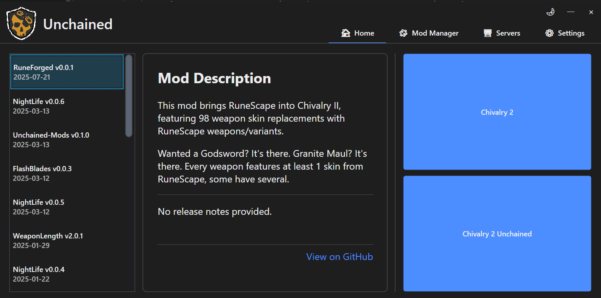
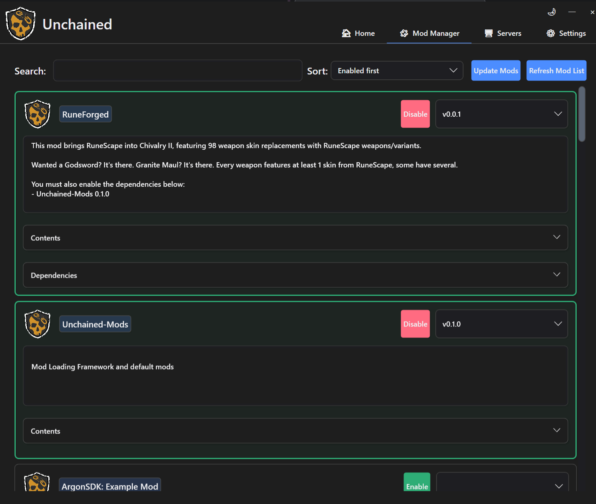
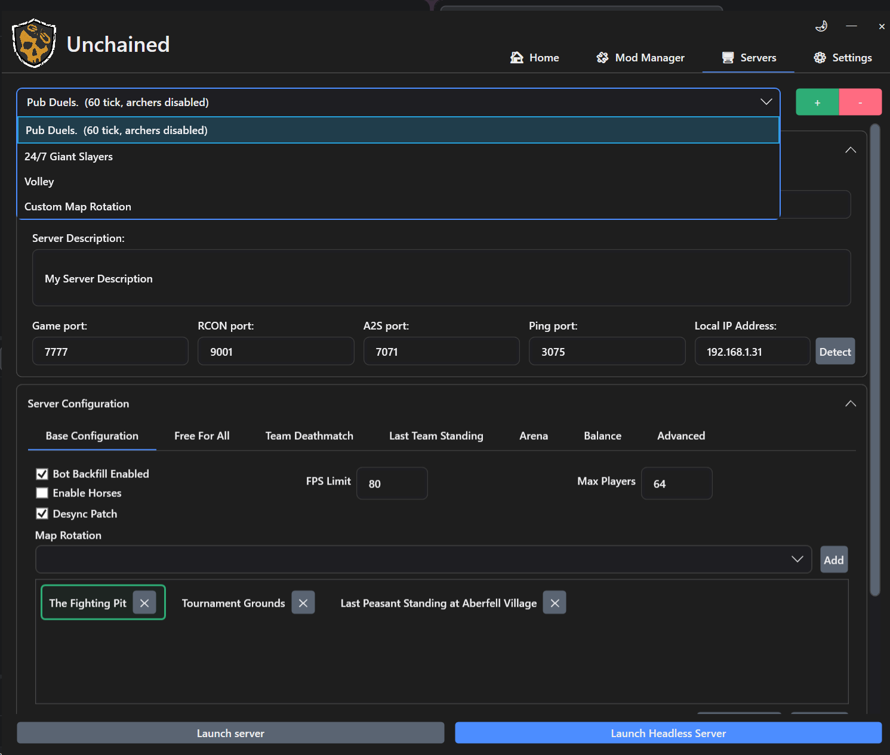
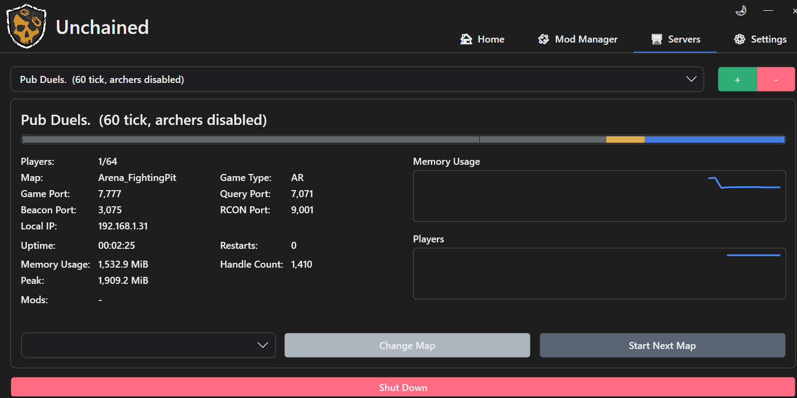
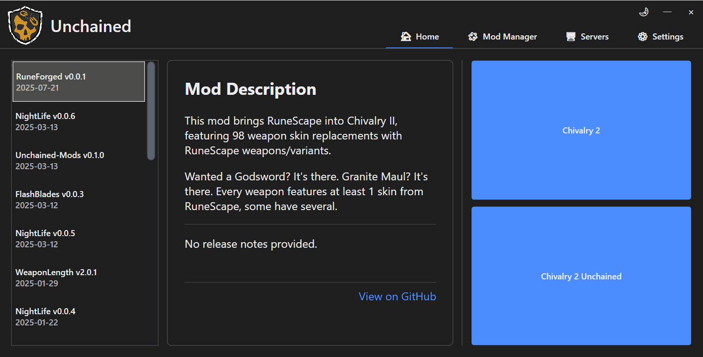

# Unchained Launcher v1.0.0-rc1 — Built From the Ground Up

The Unchained Launcher has been **completely rewritten**. Every screen, every workflow, and the entire core architecture have been rebuilt to deliver a faster, more capable, and more polished experience for players and server hosts alike.

This is a release candidate. If you run into issues, please report them on the [Discord](https://discord.gg/chiv2unchained) or open a [GitHub issue](https://github.com/Chiv2-Community/UnchainedLauncher/issues).

---

## "Vanilla with Mods" Has Been Removed

**If you relied on "Vanilla with Mods" to play on official servers with client-side mods — that option is gone.** The launch screen now offers two choices: **Chivalry 2** (vanilla) and **Chivalry 2 Unchained** (modded).

The "Vanilla with Mods" mode was removed because Torn Banner has made efforts to disable it. Client-side mod injection on official servers was too easily abused by cheaters, undermining the competitive experience for everyone. Removing this mode closes that door for good.

Going forward, mods are exclusively an Unchained experience — played offline or on community-hosted servers.

---

## What's New in Your Home Screen

The home screen is no longer just a launch pad. A **"What's New" feed** now lives on the left side, showing you every recently published mod package and update across the community. Click any entry to see its full release details right there on the home screen — no browser required.

---

## A Completely Overhauled Mod Manager

The mod manager has been rebuilt with far more visibility into what you're actually installing.

- **Asset Visibility**: Expand any mod to see exactly what it contains — markers, blueprints, maps, replacement assets, and arbitrary files. No more guessing what a mod touches.
- **Deferred Downloads**: Mods are now downloaded when the game starts, not immediately when you enable them. Toggle mods on and off freely without waiting for downloads each time.
- **Search & Sort**: Quickly find what you're looking for with the search bar and sort options at the top.

---

## Server Management — Rebuilt for Real Control

Server hosting has gone from a simple "launch and hope" to a full management experience. If you want to run servers, this is the update you've been waiting for.

### Multiple Servers, One Launcher

You can now create, configure, and manage **multiple server instances** from a single launcher window. Switch between them with the dropdown at the top of the Servers tab. Add new ones with `+`, remove old ones with `−`.

### Live Server Monitoring

Once a server is running, the view switches to a **live dashboard** showing:

- **Current player count** and player history chart
- **Current map and game type**
- **Uptime** with a visual timeline (Up / Starting / Down)
- **Memory usage** over time
- **Network ports, handles**, and other system metrics

You can also **change the map** or **advance to the next map in rotation** directly from this view.

<!-- TODO: Screenshot of a running server with the live dashboard, charts, and map controls -->

### Full Server Configuration From the Launcher

Every setting the server supports is now configurable without touching an INI file:

- **Map rotation** — add, remove, and **drag-and-drop to reorder** maps in your rotation.
- **Enabled mods** — enabling a mod in the Mod Manager no longer automatically enables it on your server. After enabling a mod globally, you must explicitly turn it on in the **Server Mod Actors** section at the bottom of your server's configuration. This gives you per-server control over which mods are active.
- **Game mode tuning** — dedicated tabs for Free For All, Team Deathmatch, Last Team Standing, Arena, and Balance settings.
- **Advanced networking** — the **Advanced tab** exposes tick rate and other networking parameters for fine-tuning server performance.

### The Desync Patch

The **Desync Patch** checkbox in server configuration **eliminates all desynchronization**. This is a massive quality-of-life improvement — no more phantom hits, no more FPS sync.

> **Note:** The desync patch is currently unstable in Team Objective (TO) mode, but works reliably in all other game modes. Use it everywhere except TO for now.

---

## A New Built-In Installer

Gone are the days of manually copying executables into your game directory. The launcher now ships with a **full installer wizard** that walks you through setup step by step.

### Step 1: Choose Your Installations

The installer automatically **scans your system** for Chivalry 2 installations — Steam, Epic Games Store, or both. Each detected installation is shown with its path and platform type. You can check off which ones you want to set up, or use **"Browse for other installation..."** if yours wasn't detected.

### Step 2: Pick a Version

A version dropdown lists **every available release**, with the latest stable version bolded. Toggle **"Show Dev Releases"** if you want to see pre-release builds. Selecting a version shows its full rendered release notes inline, and a **"View on GitHub"** button links you directly to the release page for more details.

### Step 3: Install and Go

Hit continue and watch the installation progress in a **live console log**. Once it finishes, you're prompted to pick which installation to launch — and you're in the game.

The entire flow uses a clean **Back / Continue** wizard navigation with contextual descriptions on the left side of each step, so you always know what's happening and what to do next.

---

## A Modern Settings Screen

The Settings tab has been cleaned up and reorganized:

- **General**: Installation type, automatic plugin updates, and unstable release opt-in.
- **Advanced**: Toggle the Unreal Scanner tab for local pak inspection, configure the server browser backend, manage additional mod actors, and pass custom CLI arguments.
- Clean up or fully uninstall your installation from the footer.

---

## Pak Scanning for Modders

If you develop mods, you can now enable **pak scanning** from the Settings tab. This activates the **Local Mods** tab in the navigation bar, which scans your pak directory for any `.pak` files that aren't managed by the launcher.

This makes it much easier to detect and use your own in-development paks on servers without manually tracking what's where.

---

## Dark Mode and Light Mode

A theme toggle now lives in the **title bar** of every window. Click the moon or sun icon to switch between dark and light themes instantly. Your preference is saved across sessions.

---

## Summary of Changes

| Area | What Changed |
|---|---|
| **Installer** | Built-in wizard with auto-detection, version selection, and live install log |
| **Launch Options** | "Vanilla with Mods" removed; two options remain: Vanilla and Unchained |
| **Home Screen** | New "What's New" feed showing recent mod publications |
| **Mod Manager** | Asset visibility, deferred downloads, search & sort |
| **Server Management** | Multi-server support, live dashboards, full INI-free configuration |
| **Map Rotation** | Drag-and-drop reordering |
| **Desync Patch** | One checkbox eliminates desync (unstable in TO) |
| **Server Mod Control** | Per-server mod activation, decoupled from global mod enable |
| **Advanced Networking** | Tick rate and networking tuning via Advanced tab |
| **Settings** | Reorganized, modernized layout |
| **Pak Scanning** | Detect unmanaged paks for modders |
| **Theming** | Dark/light mode toggle in title bar |

---

*Thank you to everyone who contributed to this rewrite (@nihilianth, @aroese, @jacoby6000, and @trumank). Join us on [Discord](https://discord.gg/chiv2unchained) to share feedback, report bugs, and connect with the community.*
